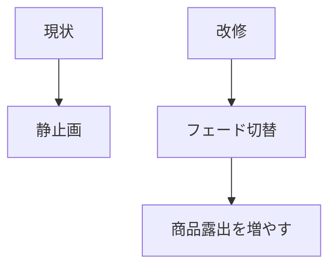
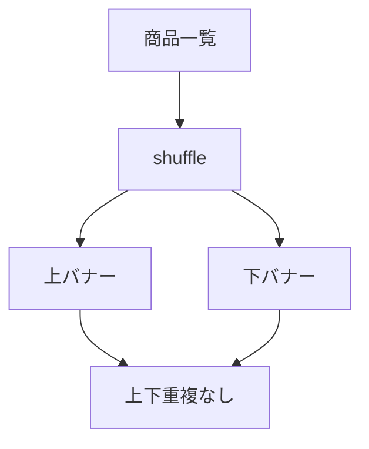

# 要件定義 PC左右バナーフェード

## 目的

PC左右バナーに動きを出す。

## 対象

| 区分 | 内容 |
|---|---|
| JS | `js/shop-side-banners.js` |
| CSS | `css/side-banners.css` |
| データ | `data/shop-apron.json` / `data/shop-table.json` |
| 表示 | PC幅のみ |

## 必須要件

| 要件 | 内容 |
|---|---|
| フェード | 画像をフェードイン・アウトで切替 |
| 上下重複 | 同じ列の上下に同じ商品を出さない |
| ライブラリ | 使わない |
| 既存データ | JSONを使う |
| リンク | 商品リンクを維持 |
| reduced motion | 1枚目だけ表示 |

## 対象外

| 対象外 | 理由 |
|---|---|
| Swiper | 操作用UIではない |
| 過去表示の記録 | localStorageが必要で複雑化する |
| スマホ表示 | 現状PC専用 |

## 推奨値

| 項目 | 値 |
|---|---|
| 1枠の商品数 | 4件 |
| 上下枠数 | 2枠 |
| 切替間隔 | 6秒 |
| フェード時間 | 3秒 |
| 周期 | 24秒 |

## 現状仕様

| 項目 | 内容 |
|---|---|
| 実装方式 | JS生成 + CSS animation |
| 商品選択 | ランダム |
| 不足補充 | 4件に満たない枠は補充する |
| 重複回避 | 同枠内と同タイミング上下を避ける |
| 左右間重複 | 見ない |
