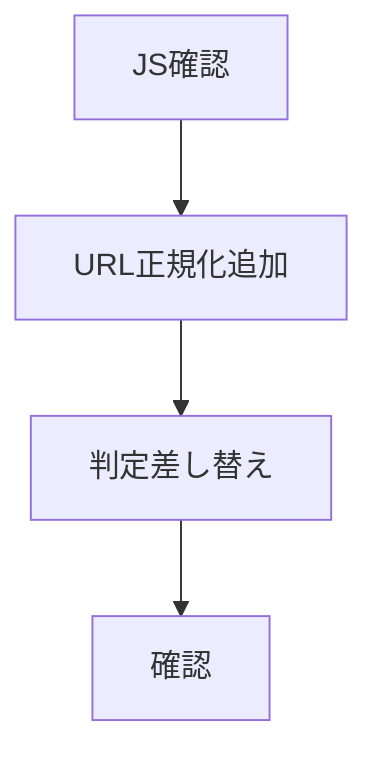
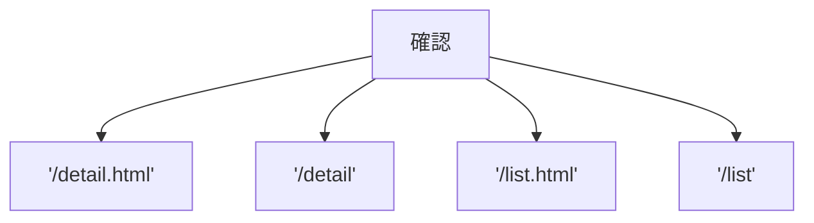

# タスク Cloudflareパンくず修正

## 手順

## タスク

| 状態 | 内容 |
|---|---|
| 完了 | `js/app-breadcrumb.js` の現状を読む |
| 完了 | `getCurrentPage` を追加する |
| 完了 | `/detail` と `/detail.html` を同じ扱いにする |
| 完了 | `/list` と `/list.html` を同じ扱いにする |
| 完了 | ローカルURLで確認する |
| 完了 | Cloudflare想定URLで確認する |

## 確認項目

| URL | 期待 |
|---|---|
| `/detail.html?id=karaage` | `HOME > 一覧 > 究極のからあげ` |
| `/detail?id=karaage` | `HOME > 一覧 > 究極のからあげ` |
| `/list.html` | `HOME > 一覧` |
| `/list` | `HOME > 一覧` |

## 完了条件

- Cloudflareの `/detail?id=...` で詳細パンくずが出る。
- 詳細タイトルが出る。
- 一覧ページでも `HOME > 一覧` が出る。
- ローカルの `.html` URLも壊れない。
