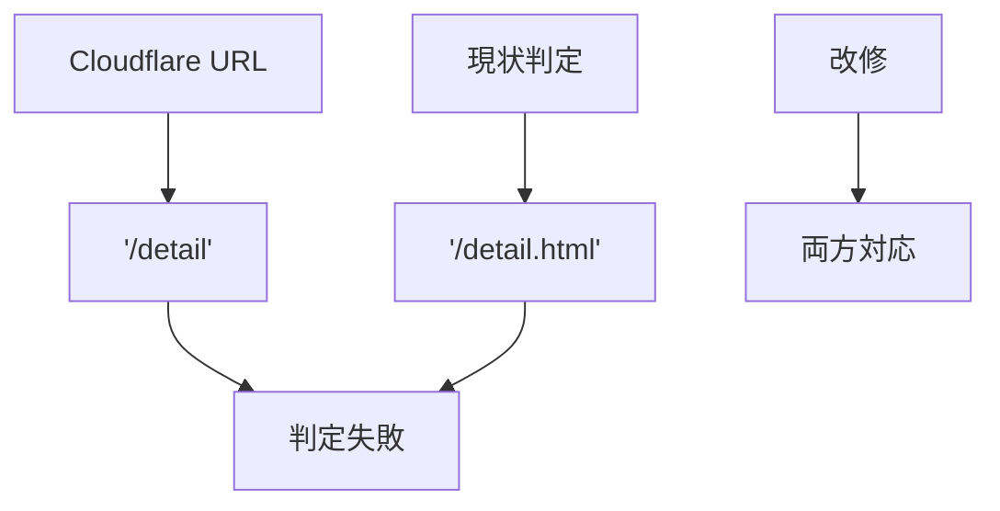
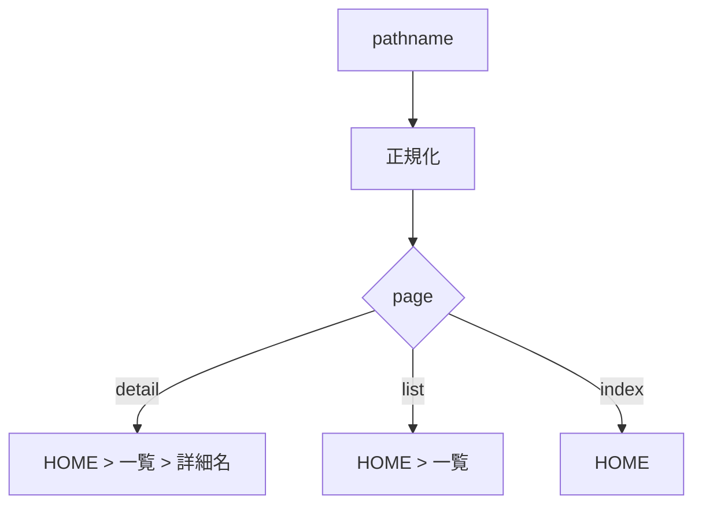

# 要件定義 Cloudflareパンくず修正

## 目的

Cloudflare Pages上でもパンくずを正しく表示する。

## 問題

| 現象 | 原因 |
|---|---|
| 詳細ページで `HOME` だけ出る | `/detail` を詳細扱いできない |
| 詳細タイトルが出ない | 詳細ページ判定に失敗する |
| 一覧でも同様 | `/list` を一覧扱いできない |

## 対象

| 区分 | 内容 |
|---|---|
| JS | `js/app-breadcrumb.js` |
| 詳細 | `/detail.html` / `/detail` |
| 一覧 | `/list.html` / `/list` |
| ローカル | 既存URLを維持 |

## 必須要件

| 要件 | 内容 |
|---|---|
| 詳細判定 | `/detail.html` と `/detail` に対応 |
| 一覧判定 | `/list.html` と `/list` に対応 |
| 詳細名 | `recipe-detail:loaded` で更新 |
| 既存挙動 | ローカルの `.html` URLを壊さない |

## 対象外

| 対象外 | 理由 |
|---|---|
| Cloudflare設定変更 | JS側で対応する |
| detail-loader改修 | 既に詳細本文は表示できている |
| CSS変更 | 表示ロジックの問題 |
