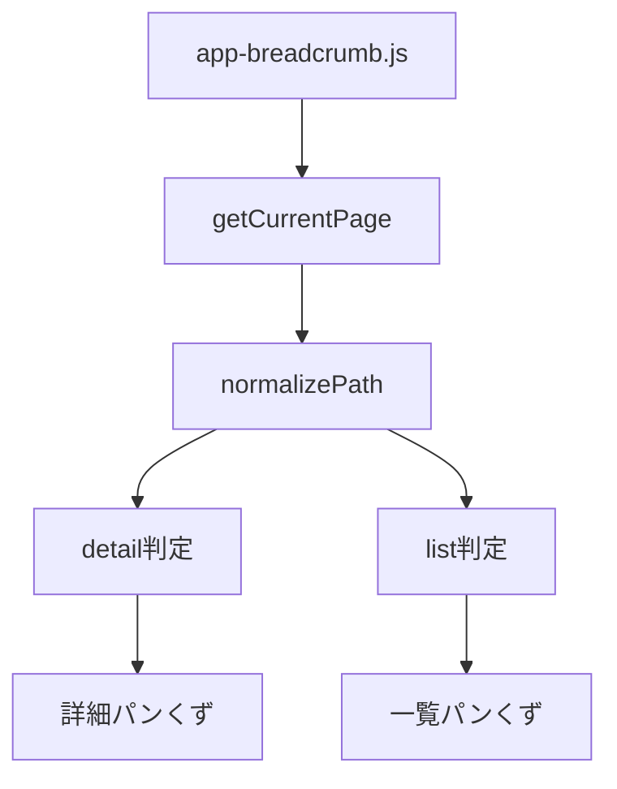
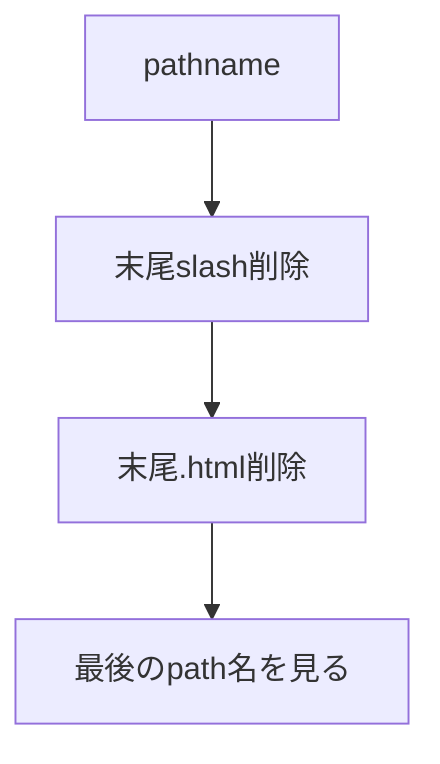
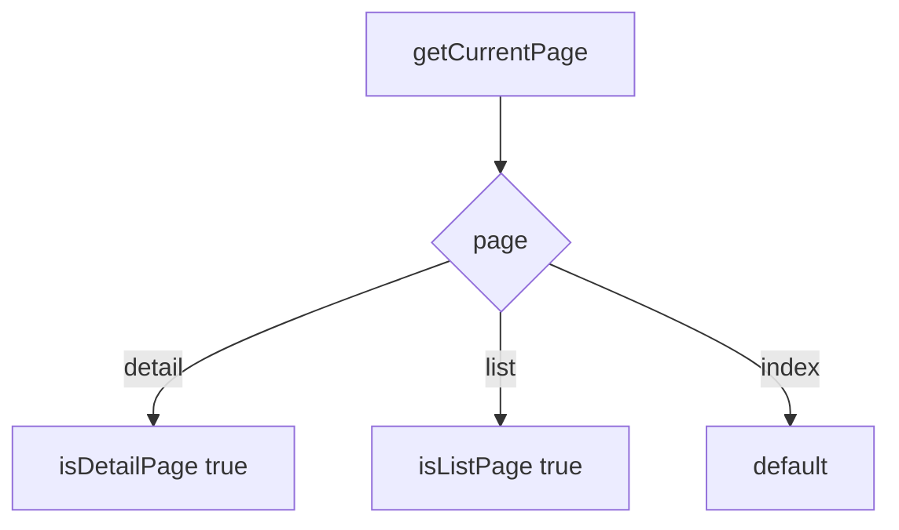
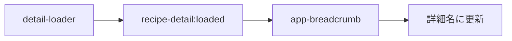

# 設計 Cloudflareパンくず修正

## 構成

## 基本方針

URL判定を正規化する。

`.html` あり・なしの両方に対応する。

## 正規化

例。

| pathname | page |
|---|---|
| `/detail.html` | `detail` |
| `/detail` | `detail` |
| `/list.html` | `list` |
| `/list` | `list` |
| `/` | `index` |
| `/index.html` | `index` |

## 判定

`createItems` は既存構成を維持する。

## 詳細タイトル

`detail-loader.js` のイベントを使う。

## リンク方針

既存リンクを維持する。

| リンク | 値 |
|---|---|
| HOME | `index.html` |
| 一覧 | `list.html` |

CloudflareでもHTMLファイルにアクセスできるため、リンクは変えない。

## 注意

- `pathname.endsWith('/detail.html')` に依存しない。
- `/detail?id=...` のqueryは判定に使わない。
- 既存の `recipe-detail:loaded` を壊さない。
