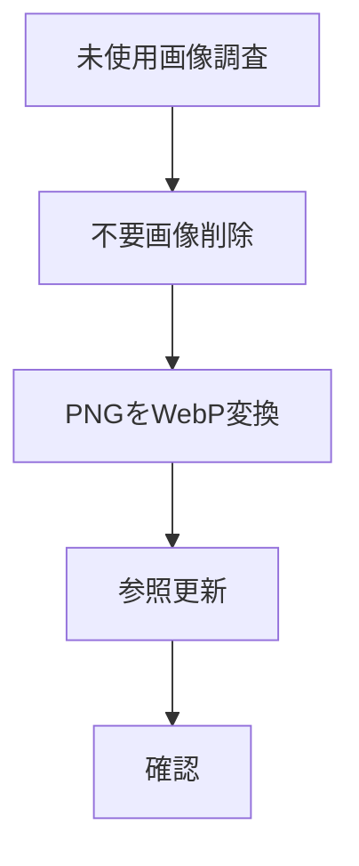

# タスク 画像整理

## 手順

## タスク

| 状態 | 内容 |
|---|---|
| 完了 | `assets/images` の画像一覧を作成する |
| 完了 | 実装ファイルの参照を検索する |
| 完了 | `docs` の参照を検索する |
| 完了 | 未使用画像を分類する |
| 完了 | `css/v1.css` の利用有無を確認する |
| 完了 | `css/v1.css` を削除する |
| 完了 | `hero_bg.png` を削除する |
| 完了 | 「疲れてる」カード画像を差し替える |
| 完了 | `oyakodon_bowl.png` を削除する |
| 完了 | PNG 44件をWebPへ変換する |
| 完了 | 実装参照を `.webp` に更新する |
| 完了 | 元PNGを削除する |
| 完了 | 退避フォルダを削除する |
| 完了 | 画像参照の存在確認をする |

## 確認項目

| 確認 | 結果 |
|---|---|
| `assets/images` のPNG | 0件 |
| WebP生成 | 44件 |
| 実装内PNG参照 | 0件 |
| 画像参照存在確認 | 121件OK |
| `index.html` | HTTP 200 |
| `list.html` | HTTP 200 |
| `detail.html?id=karaage` | HTTP 200 |

## 完了条件

- 不要画像が削除されている。
- PNG画像がWebPに置き換わっている。
- 参照切れがない。
- ローカル表示確認ができる。
