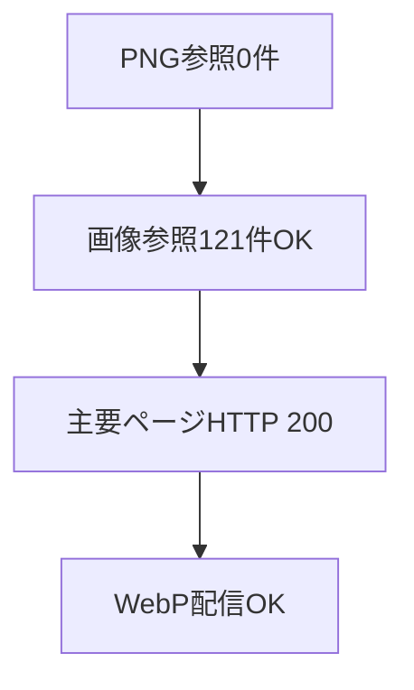

# 画像整理結果

## 集計

| 項目 | 件数 |
|---|---:|
| WebP | 44 |
| JPEG | 1 |
| AVIF | 1 |
| PNG | 0 |
| 実装内PNG参照 | 0 |
| 確認済み画像参照 | 121 |

## 容量

| 状態 | 容量 |
|---|---:|
| PNG変換前 | 約27MB |
| WebP変換後 | 約8.1MB |
| 現在の `assets/images` | 約8.9MB |

## 現在の画像

| 画像 | 形式 |
|---|---|
| `about_recipe_note.jpeg` | JPEG |
| `icon-chapdaddy.avif` | AVIF |
| `chicken_nanban_hero.webp` | WebP |
| `chicken_nanban_step_1_marinate.webp` | WebP |
| `chicken_nanban_step_2_tartar.webp` | WebP |
| `chicken_nanban_step_3_coat.webp` | WebP |
| `chicken_nanban_step_4_fry.webp` | WebP |
| `chicken_nanban_step_5_finish.webp` | WebP |
| `ebi_tofu_manju_hero.webp` | WebP |
| `ebi_tofu_manju_step_1_prep.webp` | WebP |
| `ebi_tofu_manju_step_2_mix.webp` | WebP |
| `ebi_tofu_manju_step_3_shape.webp` | WebP |
| `ebi_tofu_manju_step_4_steam.webp` | WebP |
| `ebi_tofu_manju_step_5_finish.webp` | WebP |
| `gyu_buta_don_hero.webp` | WebP |
| `gyu_buta_don_step_1_pork.webp` | WebP |
| `gyu_buta_don_step_2_beef.webp` | WebP |
| `gyu_buta_don_step_3_sauce.webp` | WebP |
| `gyu_buta_don_step_4_mix.webp` | WebP |
| `gyu_buta_don_step_5_finish.webp` | WebP |
| `hamburg_bake.webp` | WebP |
| `hamburg_hero.webp` | WebP |
| `hamburg_step_1_prep.webp` | WebP |
| `hamburg_step_2_mix.webp` | WebP |
| `hamburg_step_3_shape.webp` | WebP |
| `hamburg_step_5_finish.webp` | WebP |
| `home_hero_cooking_01.webp` | WebP |
| `home_hero_mood.webp` | WebP |
| `kakuni_finish.webp` | WebP |
| `kakuni_hero.webp` | WebP |
| `kakuni_parboil.webp` | WebP |
| `kakuni_prep.webp` | WebP |
| `kakuni_sear.webp` | WebP |
| `kakuni_simmer.webp` | WebP |
| `karaage_fry_1.webp` | WebP |
| `karaage_hero.webp` | WebP |
| `karaage_prep.webp` | WebP |
| `karaage_step_2_marinate.webp` | WebP |
| `karaage_step_3_coat.webp` | WebP |
| `karaage_step_5_finish.webp` | WebP |
| `uni_cream_pasta_hero.webp` | WebP |
| `uni_pasta_step_1_prep.webp` | WebP |
| `uni_pasta_step_2_aroma.webp` | WebP |
| `uni_pasta_step_3_base.webp` | WebP |
| `uni_pasta_step_4_sauce.webp` | WebP |
| `uni_pasta_step_5_finish.webp` | WebP |

## 削除済み

| 対象 | 理由 |
|---|---|
| `css/v1.css` | 実ページで未使用 |
| `hero_bg.png` | `css/v1.css` 削除により不要 |
| `oyakodon_bowl.png` | `ebi_tofu_manju_hero.webp` に差し替え済み |
| 未使用PNG | 参照なし |
| 変換元PNG | WebPへ置き換え済み |
| `assets/_bk-images_2026-06-18_03-50` | 不要画像確認後に削除 |
| `assets/_bk-images_2026-06-18_04-23` | WebP変換後に削除 |

## 確認

