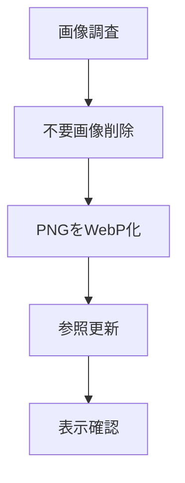

# 要件定義 画像整理

## 目的

`assets/images` を軽量化する。

不要画像を削除し、PNGをWebPへ置き換える。

## 対象

| 区分 | 内容 |
|---|---|
| 画像 | `assets/images` |
| 参照 | `html` / `css` / `js` / `json` / `partials` |
| 削除 | 未使用画像 / 退避画像 |
| 変換 | PNGからWebP |

## 最終要件

| 要件 | 結果 |
|---|---|
| 未使用画像をなくす | 完了 |
| PNG参照をなくす | 完了 |
| WebP画像へ置き換える | 完了 |
| 元PNGを残さない | 完了 |
| 参照切れを出さない | 完了 |

## 最終状態

| 項目 | 状態 |
|---|---:|
| `assets/images` のPNG | 0件 |
| WebP画像 | 44件 |
| JPEG画像 | 1件 |
| AVIF画像 | 1件 |
| 実装内PNG参照 | 0件 |
| 画像参照確認 | 121件OK |

## 削除済み

| 対象 | 理由 |
|---|---|
| 未使用画像 | 参照なし |
| `css/v1.css` | 実ページで未使用 |
| `hero_bg.png` | `css/v1.css` 削除により不要 |
| `oyakodon_bowl.png` | 「疲れてる」画像を差し替え済み |
| 退避フォルダ | 最終的に不要 |
