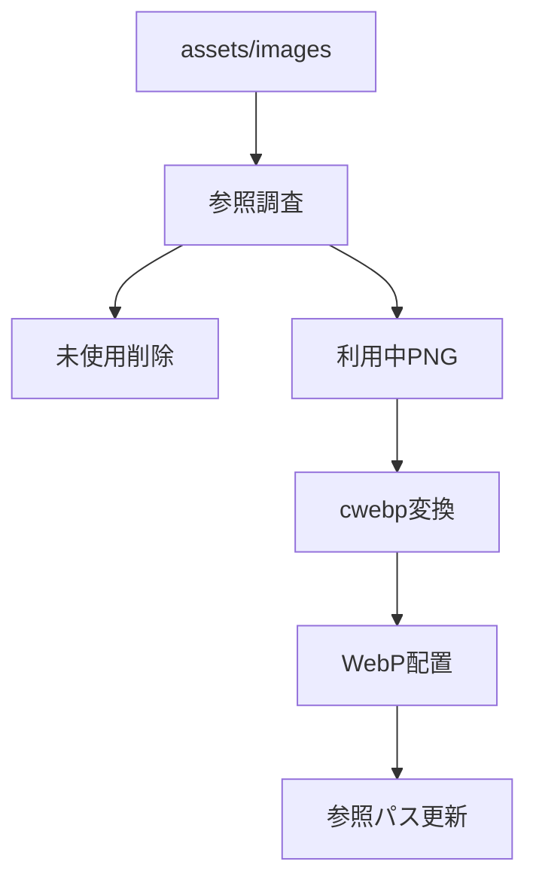
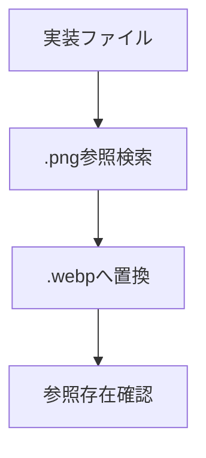

# 設計 画像整理

## 構成

## 方針

画像形式はWebPを基本にする。

`about_recipe_note.jpeg` と `icon-chapdaddy.avif` は既存形式を維持する。

## 変換

| 項目 | 内容 |
|---|---|
| 変換元 | `assets/images/*.png` |
| 変換先 | `assets/images/*.webp` |
| ツール | `cwebp` |
| 品質 | `-q 82` |

## 参照更新

| 対象 | 内容 |
|---|---|
| HTML | `index.html` / `list.html` / `detail.html` |
| JS | `js/*.js` |
| JSON | `data/*.json` |
| CSS | `css/*.css` |
| partial | `partials/details/*.html` |

## 削除

| 対象 | 処理 |
|---|---|
| 未使用PNG | 削除 |
| 変換後PNG | 削除 |
| 退避フォルダ | 削除 |
| `css/v1.css` | 削除 |

## 確認

| 確認 | 結果 |
|---|---|
| 実装内PNG参照 | 0件 |
| 画像参照存在確認 | 121件OK |
| `index.html` | HTTP 200 |
| `list.html` | HTTP 200 |
| `detail.html?id=karaage` | HTTP 200 |
| WebP配信 | HTTP 200 / `image/webp` |
