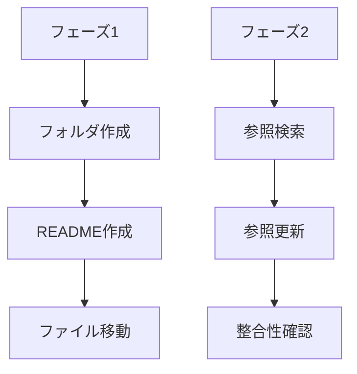

# タスク docs整理と_worklogs運用

## 作業



## フェーズ1

| 状態 | タスク |
|---|---|
| 完了 | `_docs/` を作成する |
| 完了 | `_docs/README.md` を作成する |
| 完了 | `_worklogs/README.md` を作成する |
| 完了 | 全体資料を `_docs/` に移動する |
| 完了 | 作業単位ドキュメントを `_worklogs/` に移動する |
| 完了 | `docs` が不要なら削除する |
| 完了 | `git status --short` で差分を確認する |

## フェーズ1完了条件

| 確認 | 期待結果 |
|---|---|
| `_docs` | ルール・マニュアル・全体資料のみ |
| `_worklogs` | 作業単位ドキュメントのみ |
| `docs` | 空、または削除済み |
| 実装ファイル | 変更なし |

## フェーズ2

| 状態 | タスク |
|---|---|
| 完了 | `docs` 参照を検索する |
| 完了 | 参照先を `_docs/` と `_worklogs/` に更新する |
| 完了 | `site-context` を新構成に更新する |
| 完了 | `docs` 参照の残存を確認する |
| 完了 | `git status --short` で差分を確認する |

## フェーズ2完了条件

| 確認 | 期待結果 |
|---|---|
| `docs` 参照 | 0件、または意図した残存のみ |
| `_docs/` 参照 | 全体資料を指す |
| `_worklogs/` 参照 | 作業単位ドキュメントを指す |
| 実装ファイル | 変更なし |

## 検索候補

```bash
rg "(^|[^_])docs/"
```

```bash
rg "_docs/|_worklogs/"
```

```bash
git status --short
```

## 備考

フェーズ1とフェーズ2は分けて実行できる。

今回の3ファイル作成は `_worklogs` 運用テストを兼ねる。
