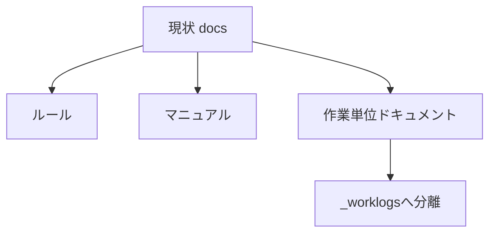
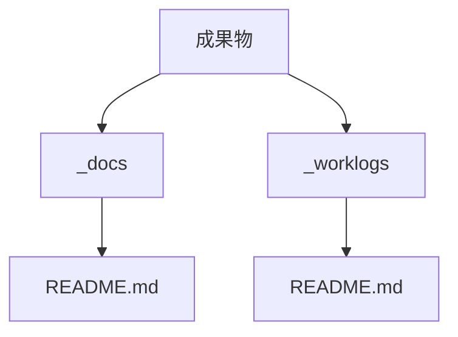

# 要件定義 docs整理と_worklogs運用

## 目的

`docs` の責務を減らす。

## 背景

- `docs` に作業単位ドキュメントが増えている。
- `docs` はルールやマニュアル関連に寄せたい。
- 作業履歴は通常のソースと区別したい。

## 対象

| 対象 | 内容 |
|---|---|
| `_worklogs/2026-..._*` | 作業単位ドキュメント |
| `_docs/site-context_*.md` | サイトコンテキスト |
| `_docs/設計_共通.md` | 共通設計 |
| `_docs/サイトマップ.md` | サイト全体資料 |
| `_docs/Swiperドキュメン関連.md` | 外部ライブラリ資料 |

## 非対象

- HTML実装。
- CSS実装。
- JS実装。
- 画像データ。

## 成果物

| 成果物 | 内容 |
|---|---|
| `_docs/` | ルール・マニュアル・全体資料 |
| `_worklogs/` | 作業単位ドキュメント |
| `README.md` | フォルダ責務の説明 |

## 要件

- `_` 接頭詞で管理用フォルダを区別する。
- 作業単位ドキュメントは `_worklogs` に置く。
- ルール・マニュアル・全体資料は `_docs` に置く。
- 移動後に古い `docs` 参照を更新する。
- 既存ファイルの内容は不要に改変しない。
