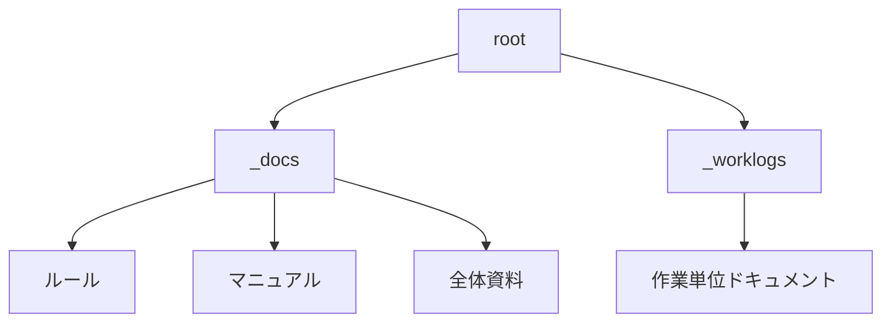
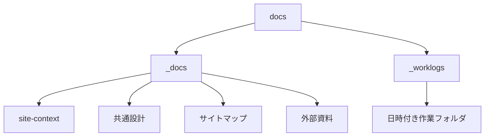
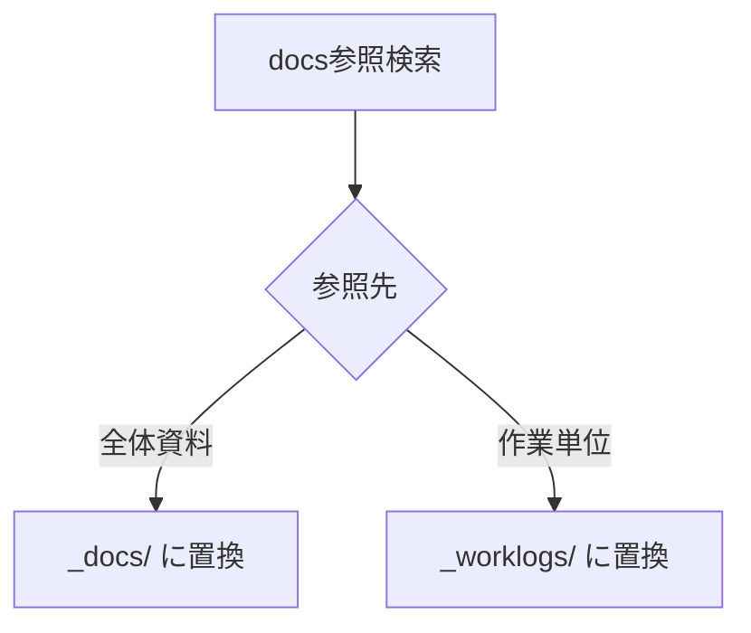

# 設計 docs整理と_worklogs運用

## 構成



## フォルダ責務

| フォルダ | 責務 |
|---|---|
| `_docs` | ルール・マニュアル・全体資料 |
| `_worklogs` | 作業単位ドキュメント |

## 移動分類



| 移動先 | 対象 |
|---|---|
| `_docs` | `site-context_*.md` |
| `_docs` | `設計_共通.md` |
| `_docs` | `サイトマップ.md` |
| `_docs` | `Swiperドキュメン関連.md` |
| `_worklogs` | `2026-..._*` の作業単位フォルダ |

## README

`_docs/README.md` を作る。

```text
_docs は、サイト全体のルール、共通設計、マニュアル、現状コンテキストを保管する。
作業単位ドキュメントは _worklogs に保管する。
```

`_worklogs/README.md` を作る。

```text
_worklogs は、作業単位ドキュメントを保管する。
1つの作業ごとに日時付きフォルダを作る。
各フォルダには、必要に応じて要件定義・設計・タスク・資料を置く。
```

## 参照更新



| 古い参照 | 新しい参照 |
|---|---|
| `docs/site-context_...` | `_docs/site-context_...` |
| `docs/設計_共通.md` | `_docs/設計_共通.md` |
| `docs/サイトマップ.md` | `_docs/サイトマップ.md` |
| `docs/Swiperドキュメン関連.md` | `_docs/Swiperドキュメン関連.md` |
| `_worklogs/2026-...` | `_worklogs/2026-...` |

## 注意

- `docs` と `_docs` を混在させない。
- 古い `docs` 参照を残さない。
- 作業単位フォルダ内の既存ファイル名は維持する。
- 実装ファイルはこの作業で変更しない。
