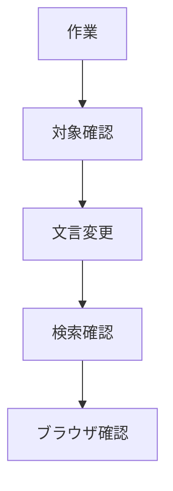

# タスク 店長設定と材料表記統一

## タスク



| 状態 | タスク |
|---|---|
| 完了 | `index.html` の人物設定を店長へ変更する |
| 完了 | 詳細ページ7件の見出しを `店長の独り言` へ変更する |
| 完了 | 詳細ページ7件の材料補足文を `男性1人分` へ統一する |
| 完了 | `rg` で旧文言と材料補足を確認する |
| 完了 | ローカルサーバーで表示確認する |

## 確認コマンド

```bash
rg -n "コヤマの独り言|店長の独り言|男性1人分|鶏肉の下準備|ハンバーグ|基本材料" index.html partials/details
```

## 表示確認URL

```text
http://127.0.0.1:8000/index.html
http://127.0.0.1:8000/detail.html?id=karaage
http://127.0.0.1:8000/detail.html?id=hamburg
http://127.0.0.1:8000/detail.html?id=kakuni
```
