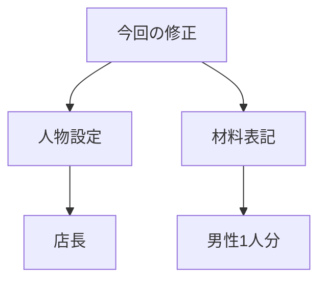
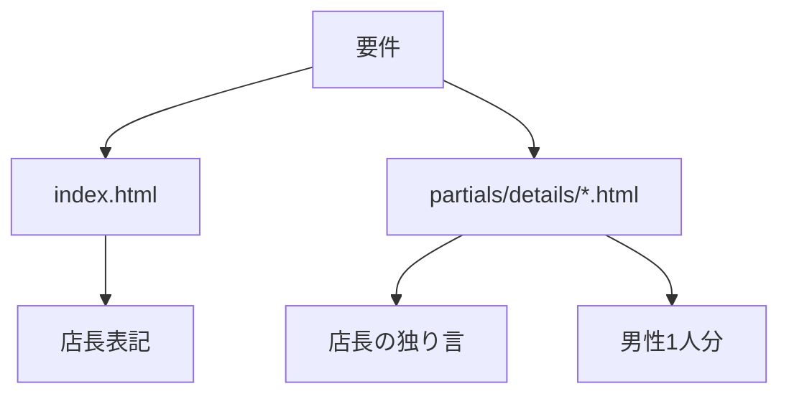

# 要件定義 店長設定と材料表記統一

## 目的

人物設定と材料表記を統一する。

## 対象

| 対象 | 内容 |
|---|---|
| トップページ | 「無責任レシピとは」のコヤマ定義を店長へ変更する |
| 詳細ページ | 「コヤマの独り言」を「店長の独り言」へ変更する |
| 詳細ページ | 材料セクションの補足文を「男性1人分」へ統一する |

## 要件

- トップページの人物設定を店長にする。
- 詳細ページ7件の見出しを `店長の独り言` にする。
- 詳細ページ7件の材料補足文を `男性1人分` にする。
- 既存レイアウトは変更しない。
- 既存CSSは変更しない。

## 完了条件

| 項目 | 条件 |
|---|---|
| トップ | 店長設定が表示される |
| 詳細 | `店長の独り言` が表示される |
| 詳細 | 材料補足が全て `男性1人分` になる |
