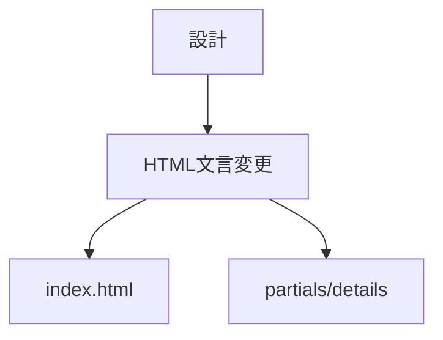
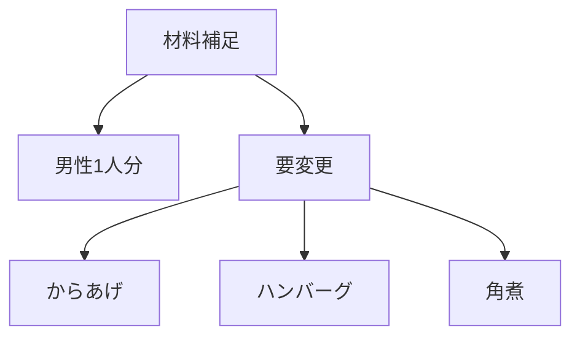
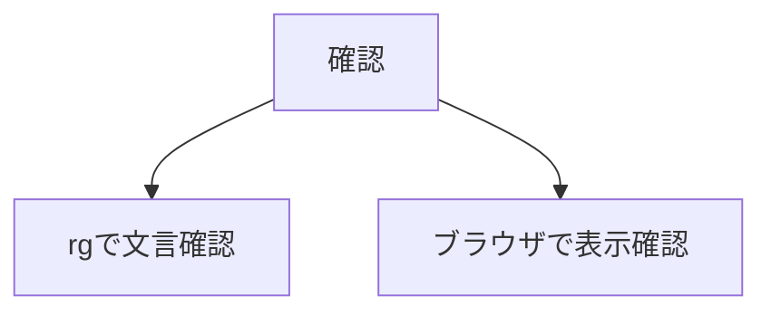

# 設計 店長設定と材料表記統一

## 方針

文言のみを最小差分で変更する。

## 変更対象

| ファイル | 変更 |
|---|---|
| `index.html` | `Chapdaddy代表デザイナー・コヤマ` を店長表記へ変更する |
| `partials/details/detail_*.html` | `コヤマの独り言` を `店長の独り言` へ変更する |
| `partials/details/detail_*.html` | 材料補足文を `男性1人分` へ変更する |

## 材料補足の現状

| ファイル | 現状 |
|---|---|
| `detail_chicken_nanban.html` | `男性1人分` |
| `detail_ebi_tofu_manju.html` | `男性1人分` |
| `detail_gyu_buta_don.html` | `男性1人分` |
| `detail_uni_cream_pasta.html` | `男性1人分` |
| `detail_karaage.html` | `鶏肉の下準備` |
| `detail_hamburg.html` | `ハンバーグ` |
| `detail_kakuni.html` | `基本材料` |

## 確認

- `コヤマの独り言` が残っていないことを確認する。
- 材料補足が `男性1人分` に統一されていることを確認する。
- トップページの人物設定が店長になっていることを確認する。
