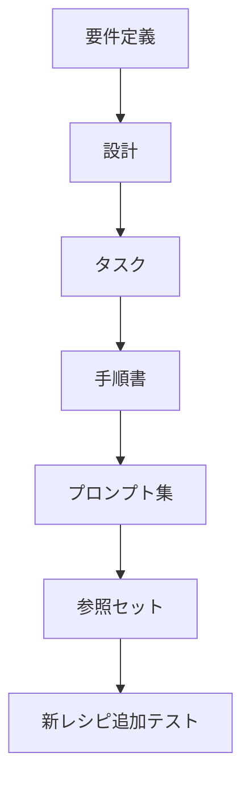
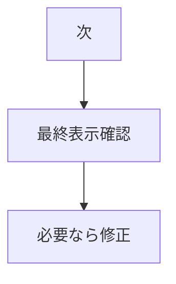
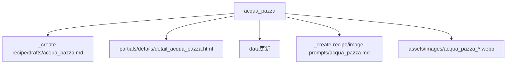

# タスク レシピ更新システム

## 進行

## タスク

- [x] 要件定義を作成する。
- [x] 設計を作成する。
- [x] タスクを作成する。
- [x] `_create-recipe/` の保存構成を作成する。
- [x] 更新手順書を作成する。
- [x] 段階別プロンプトを作成する。
- [x] 参照セットを作成する。
- [x] 写メから新レシピdraftを作成する。
- [x] draftを確認する。
- [x] draftのfeedbackを反映する。
- [x] draftから詳細HTMLを作成する。
- [x] 詳細HTMLを確認する。
- [x] data関連を更新する。
- [x] data関連を確認する。
- [x] 画像生成プロンプトを作成する。
- [x] 画像生成プロンプトを確認する。
- [x] 画像作成プロンプトを作成する。
- [x] hero画像を作成する。
- [x] step画像5枚を作成する。
- [ ] 最終表示確認を行う。

## 次に作るもの

## 確認項目

- [x] レシピIDが重複していない。
- [x] 詳細HTMLが読み込める。
- [x] `recipes.json` がJSONとして正しい。
- [x] `recipe-details.json` がJSONとして正しい。
- [x] hero画像が作成されている。
- [x] step画像が5枚作成されている。
- [ ] 一覧から詳細へ遷移できる。
- [ ] hero画像が表示される。
- [ ] step画像が5枚表示される。

## テスト対象

