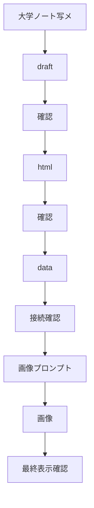
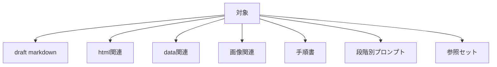
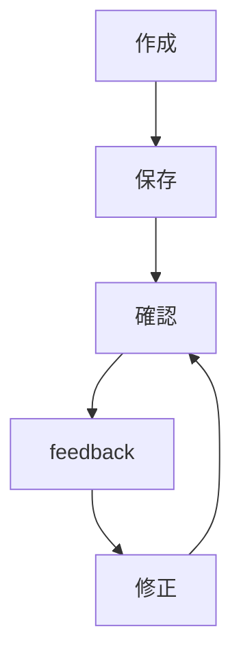
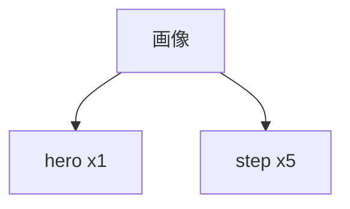
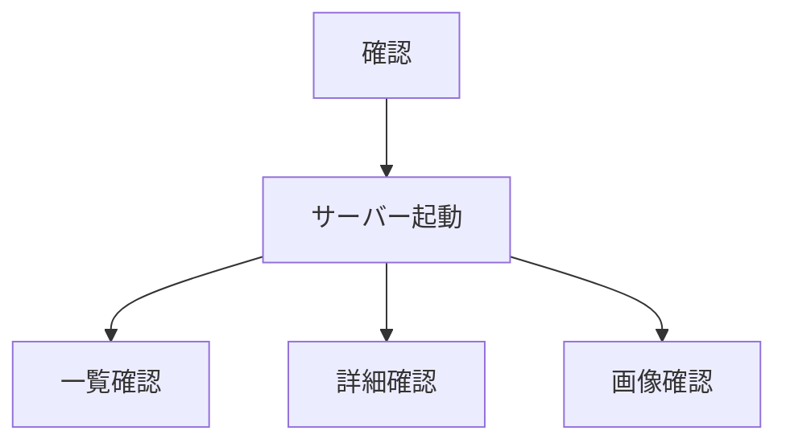
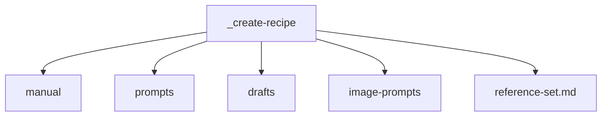
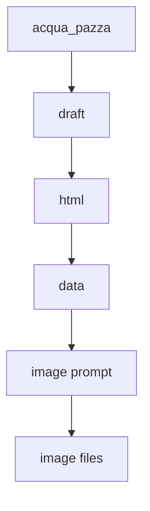

# 要件定義 レシピ更新システム

## 目的

大学ノート写メから新規レシピを追加する。

更新作業を段階化する。

各段階で確認とfeedbackを行う。



## 対象



| 対象 | 内容 |
|---|---|
| draft markdown | 写メから作る原稿 |
| html関連 | `partials/details/detail_レシピ名.html` |
| data関連 | `data/recipe-details.json` / `data/recipes.json` |
| 画像関連 | hero画像1枚 / step画像5枚 |
| 手順書 | 更新手順のマニュアル |
| 段階別プロンプト | Codexへ渡す作業指示 |
| 参照セット | 代表ファイルと代表画像 |

## 更新方針

段階ごとに成果物を保存する。

段階ごとに内容を確認する。

feedbackを反映してから次へ進む。



## 画像要件

AI生成で作成する。

手順画像も作成する。



| 種別 | 数 |
|---|---:|
| メイン画像 | 1 |
| 手順画像 | 5 |

## 命名例

```text
assets/images/chicken_nanban_hero.webp
assets/images/chicken_nanban_step_1_marinate.webp
assets/images/chicken_nanban_step_2_tartar.webp
assets/images/chicken_nanban_step_3_coat.webp
assets/images/chicken_nanban_step_4_fry.webp
assets/images/chicken_nanban_step_5_finish.webp
```

## 確認要件

ローカルHTTPサーバーで確認する。

表示内容を確認する。

一覧と詳細の接続を確認する。

画像表示を確認する。



## 現状の保存場所



| 保存先 | 内容 |
|---|---|
| `_create-recipe/manual/` | 手順書 |
| `_create-recipe/prompts/` | 01から06の段階別プロンプト |
| `_create-recipe/drafts/` | draft |
| `_create-recipe/image-prompts/` | 画像生成プロンプト |
| `_create-recipe/reference-set.md` | 参照セット |

## テスト実績

`acqua_pazza` で一連の手順をテストした。



## 制約

既存変更を勝手に戻さない。

既存レシピの構造に合わせる。

CSSの追加は必要最小限にする。

実装前に対象ファイルを読む。
