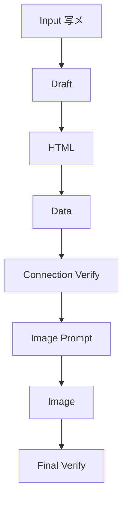
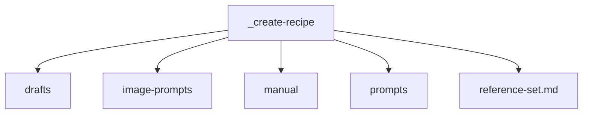
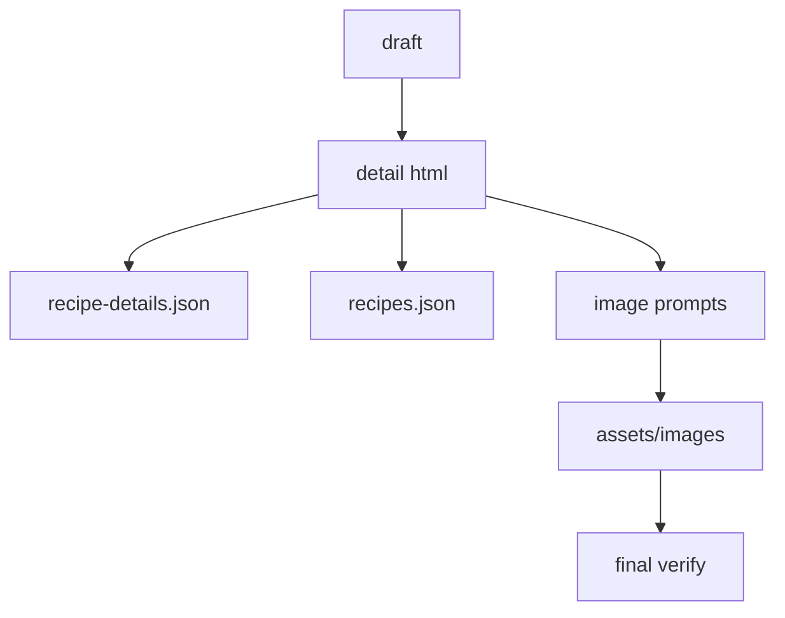
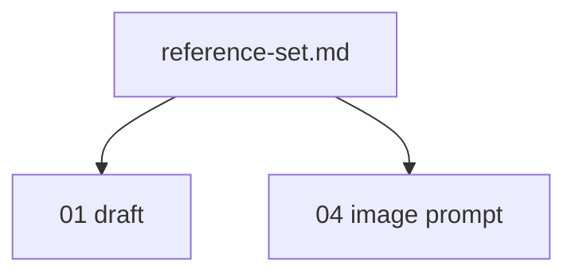
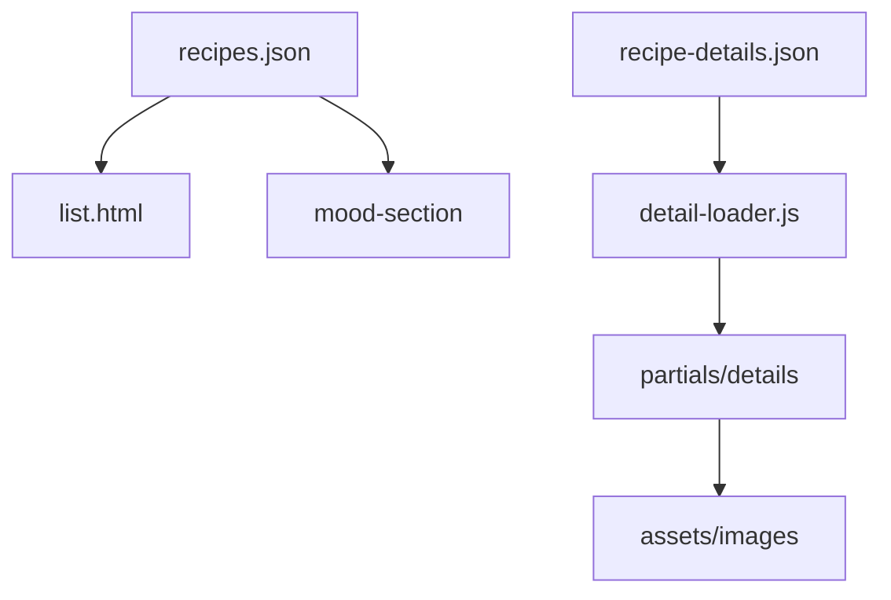
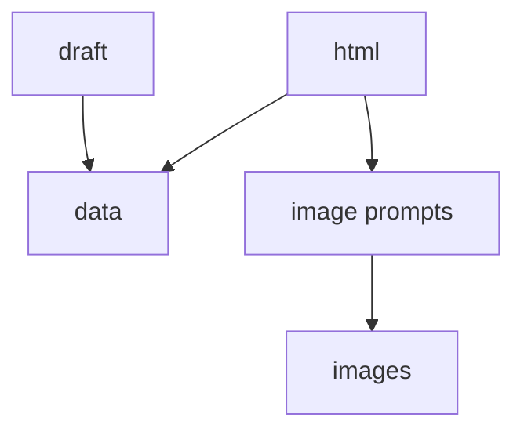
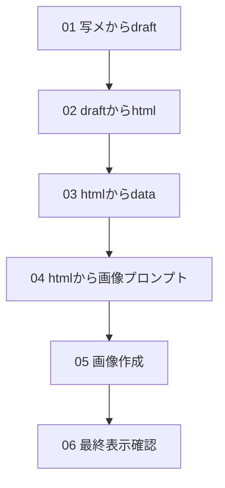

# 設計 レシピ更新システム

## 全体設計

人がCodexに段階的に依頼する。

各段階で成果物を確認する。

確認後に次の段階へ進む。



## 成果物構成



| 保存先 | 役割 |
|---|---|
| `_create-recipe/drafts/` | レシピ原稿 |
| `_create-recipe/image-prompts/` | AI画像生成プロンプト |
| `_create-recipe/manual/` | 更新手順書 |
| `_create-recipe/prompts/` | 段階別プロンプト |
| `_create-recipe/reference-set.md` | 参照セット |

## 既存サイトへの反映



| ファイル | 役割 |
|---|---|
| `partials/details/detail_レシピID.html` | 詳細本文 |
| `data/recipe-details.json` | IDと詳細HTMLの対応 |
| `data/recipes.json` | 一覧表示用データ |
| `assets/images/*.webp` | hero画像と手順画像 |

## 段階設計

### 1. draft作成

写メから料理名、材料、作り方、注意点を起こす。

曖昧な点は仮置きする。

確認しやすいMarkdownにする。

### 2. html作成

既存の詳細HTML構造に合わせる。

hero、基本情報、材料、作り方、店長の独り言を含める。

手順は5ステップに整理する。

### 3. data更新

`recipe-details.json` にID、タイトル、HTMLパスを追加する。

`recipes.json` に一覧用情報を追加する。

`moods` は既存4種類から選ぶ。

`detail.html?id=レシピID` で接続確認を行う。

### 4. 画像プロンプト作成

hero画像1件を作る。

step画像5件を作る。

画像名はHTML内の参照名と合わせる。

### 5. 画像作成

画像生成プロンプトから画像ファイルを作る。

`assets/images/` に保存する。

data更新は行わない。

HTML更新は原則行わない。

### 6. 最終表示確認

HTTPサーバーを起動する。

一覧ページを確認する。

詳細ページを確認する。

画像の表示を確認する。

## 参照セット



| 段階 | 参照 |
|---|---|
| 01 draft | 代表HTML / `data/recipes.json` |
| 04 画像プロンプト | 代表画像 |

## データ関係



## 判断ルール

HTMLだけからdataを作らない。

draftとHTMLを見てdataを作る。

画像はHTMLの内容から生成する。



画像作成ではdata更新を行わない。

HTML更新は、画像ファイル名が一致しない場合だけ検討する。

## 確認方法

```bash
python3 -m http.server 8000
```

```text
http://127.0.0.1:8000/index.html
http://127.0.0.1:8000/list.html
http://127.0.0.1:8000/detail.html?id=レシピID
```

## 現状プロンプト


