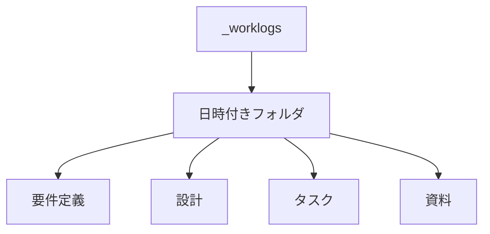

# _worklogs

作業単位ドキュメントを保管する。

```mermaid
flowchart TD
  A[_worklogs] --> B[日時付きフォルダ]
  B --> C[要件定義]
  B --> D[設計]
  B --> E[タスク]
  B --> F[資料]
```

- 1つの作業ごとに日時付きフォルダを作る。
- 各フォルダには、必要に応じて要件定義・設計・タスク・資料を置く。
