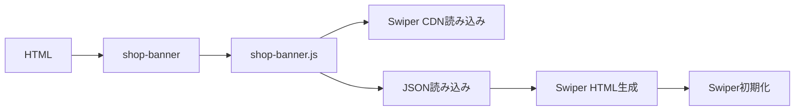
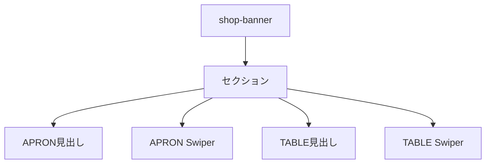
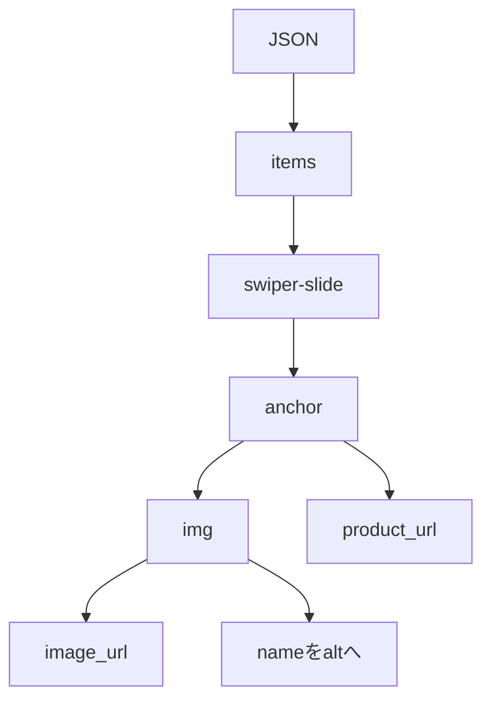
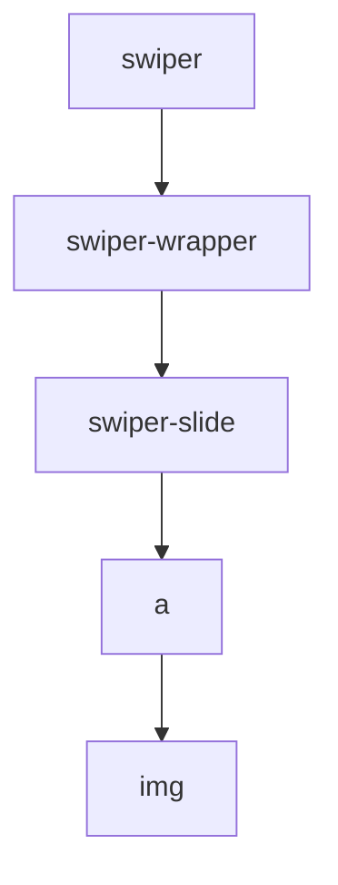
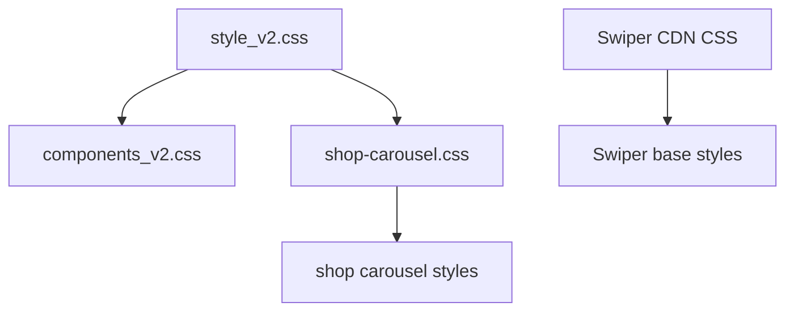
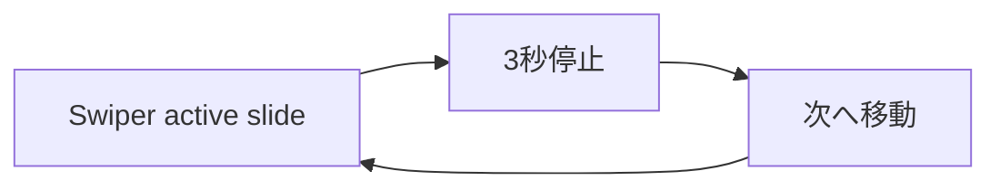

# 設計 下部ECカルーセル

## 構成

既存の `<shop-banner>` を下部ECカルーセルへ置き換える。

## ライブラリ

SwiperはCDNで読み込む。

| 種類 | URL |
|---|---|
| CSS | `https://cdn.jsdelivr.net/npm/swiper@12/swiper-bundle.min.css` |
| JS | `https://cdn.jsdelivr.net/npm/swiper@12/swiper-bundle.min.js` |

## コンポーネント

## データフロー

## HTML生成

Swiperの基本構造に合わせる。

| 要素 | 内容 |
|---|---|
| ラッパー | 下部ECエリア |
| 見出し | アイコン + `APRON｜着る` |
| 見出し | アイコン + `TABLE｜食べる` |
| 商品 | `.swiper-slide` 内の `` |
| 画像alt | JSONの `name` |
| リンク | `target="_blank"` |
| 安全属性 | `rel="noopener noreferrer"` |

## CSS配置

CSSは `docs/設計_共通.md` に従う。

| 種類 | 配置 |
|---|---|
| 共通UI部品 | `css/components_v2.css` |
| 下部ECカルーセル | `css/shop-carousel.css` |
| Swiper基本CSS | CDN |
| 余白値 | 既存トークンを優先 |
| 例外 | 必要時のみ `css/utilities_v2.css` |

## CSS方針

| 項目 | 方針 |
|---|---|
| 商品幅 | Swiper設定を優先 |
| 比率 | `aspect-ratio: 1 / 1` |
| 画像 | `object-fit: contain` |
| はみ出し | Swiperの `slidesPerView` で見せる |
| Nesting | 2階層まで |
| `!important` | 使わない |

## Swiper設定

中央で3秒停止してから次の商品へ進む。

| 項目 | 内容 |
|---|---|
| `loop` | `true` |
| `centeredSlides` | `true` |
| `slidesPerView` | `auto` |
| `autoplay.delay` | `3000` |
| `autoplay.disableOnInteraction` | `false` |
| reduced motion | autoplay停止 |

## エラー時

| 状態 | 対応 |
|---|---|
| Swiper取得失敗 | 旧バナーまたは静的商品表示 |
| JSON取得失敗 | 該当段を非表示 |
| 商品0件 | 該当段を非表示 |
| 画像失敗 | 該当画像を非表示 |

## 実装対象外

PC左右ランダムバナーは実装しない。
