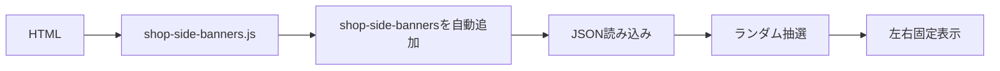
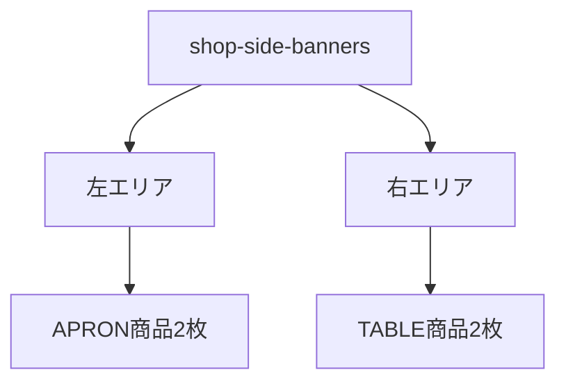
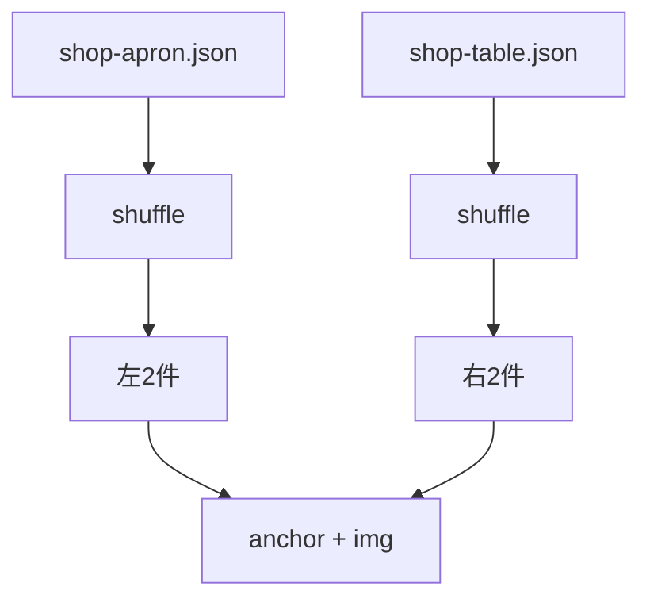
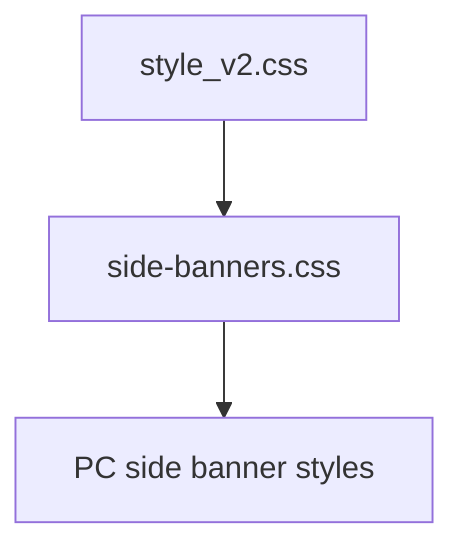
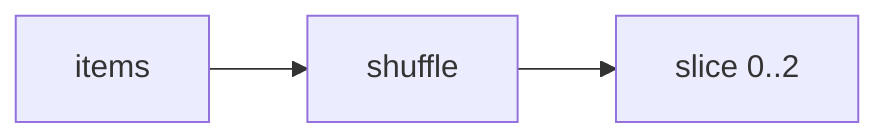

# 設計 PC左右ランダムバナー

## 構成

PC左右ランダムバナーは独立コンポーネントにする。

## コンポーネント

## データフロー

## HTML生成

| 要素 | 内容 |
|---|---|
| カスタム要素 | `<shop-side-banners>` |
| 追加方法 | `shop-side-banners.js` が `body` 末尾へ自動追加 |
| 左ラッパー | APRON商品2枚 |
| 右ラッパー | TABLE商品2枚 |
| 商品 | `<a>` 内に `` |
| 画像alt | JSONの `name` |
| リンク | `target="_blank"` |
| 安全属性 | `rel="noopener noreferrer"` |

## CSS配置

CSSは `docs/設計_共通.md` に従う。

| 種類 | 配置 |
|---|---|
| PC左右バナー | `css/side-banners.css` |
| 余白値 | 既存トークンを優先 |
| 例外 | 必要時のみ `css/utilities_v2.css` |

## CSS方針

| 項目 | 方針 |
|---|---|
| 表示条件 | `min-width: 1280px` |
| 配置 | `position: fixed` |
| 左右位置 | `.la_app` の外側 |
| 画像 | `object-fit: contain` |
| `!important` | 使わない |

## ランダム抽選

ページ表示ごとに抽選する。

| 項目 | 内容 |
|---|---|
| 左側 | APRONから2件 |
| 右側 | TABLEから2件 |
| 重複 | 同じ側では重複しない |

## エラー時

| 状態 | 対応 |
|---|---|
| JSON取得失敗 | 該当側を非表示 |
| 商品2件未満 | 取得できた件数だけ表示 |
| 商品0件 | 該当側を非表示 |
| 1280px未満 | 全体を非表示 |

## 実装対象外

SP表示では出さない。
