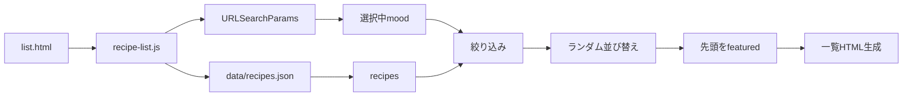
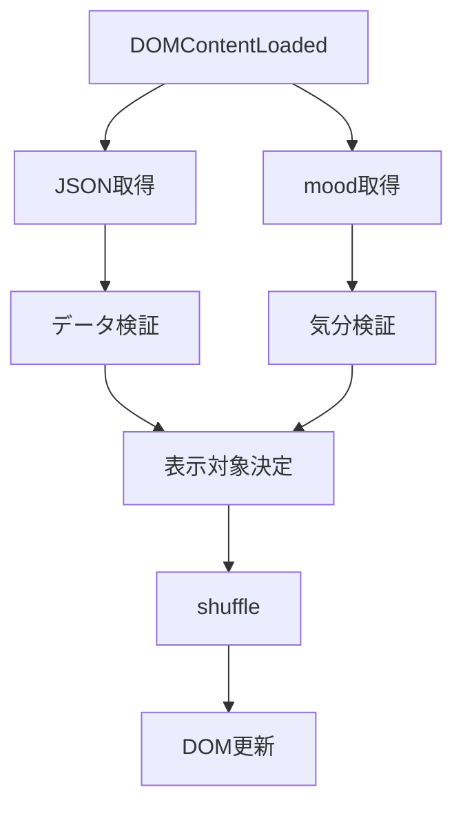
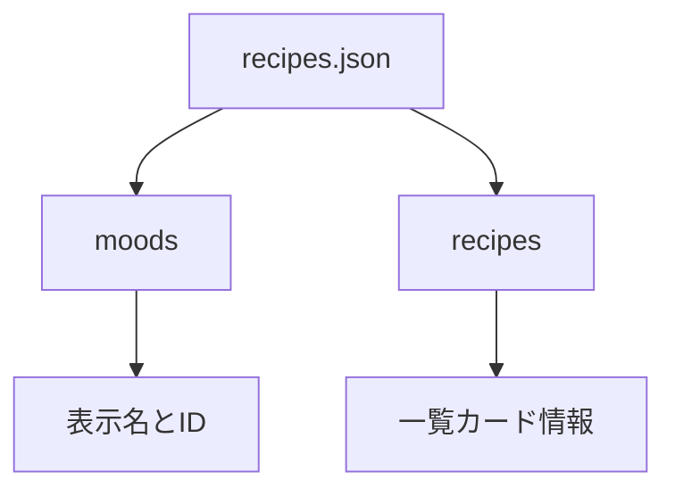
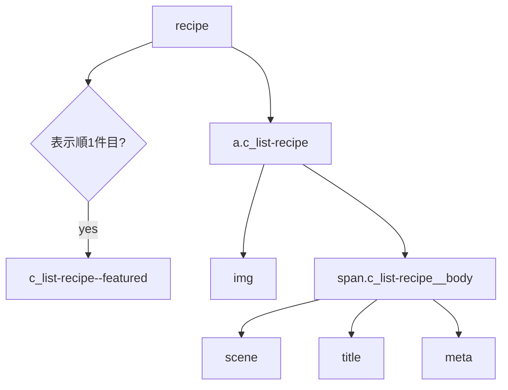
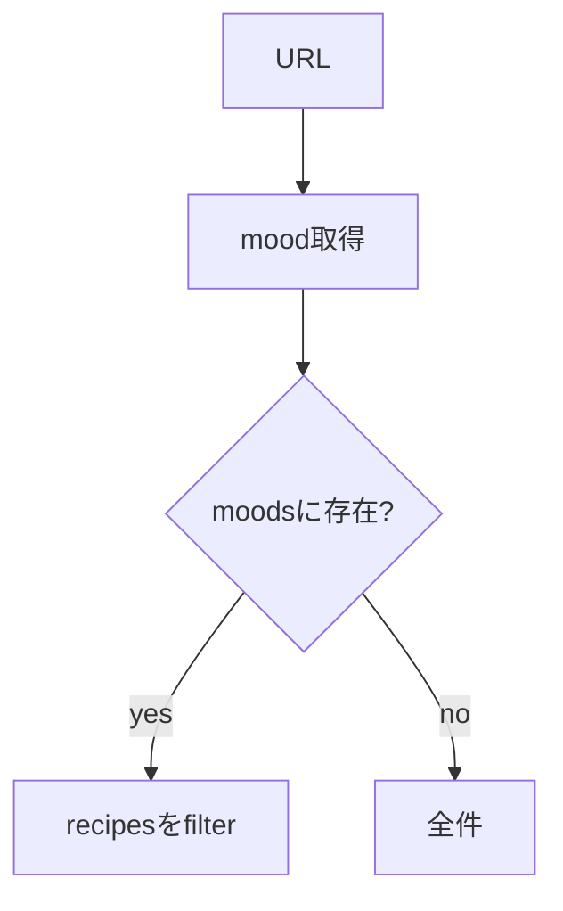
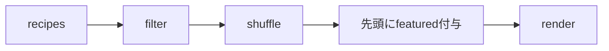
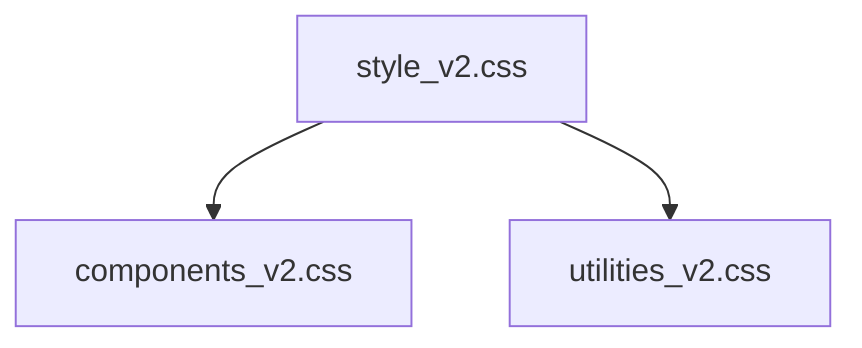

# 設計 気分一覧

## 構成

`list.html` が JavaScript で `data/recipes.json` を読み込む。



## JavaScript

読み込み、絞り込み、出力は JavaScript で行う。

| 項目 | 内容 |
|---|---|
| 配置 | `js/recipe-list.js` |
| 読み込み | `fetch('./data/recipes.json')` |
| クエリ取得 | `URLSearchParams` |
| 絞り込み | `recipe.moods.includes(mood)` |
| 並び順 | 表示ごとにランダム |
| featured | 表示配列の1件目 |
| 出力 | 既存カード構造を生成 |
| 失敗時 | 既存静的HTMLを残す |



## JSON

`data/recipes.json` は気分定義とレシピ一覧を持つ。



```json
{
  "moods": [
    { "id": "hearty", "label": "ガッツリ" },
    { "id": "light", "label": "さっぱり" },
    { "id": "tired", "label": "疲れてる" },
    { "id": "drink", "label": "酒飲みたい" }
  ],
  "recipes": [
    {
      "title": "ふわっと海老の豆腐まんじゅう",
      "file": "detail_ebi_tofu_manju.html",
      "image": "./assets/images/ebi_tofu_manju_hero.png",
      "scene": "夜遅めでも軽く満たす",
      "time": "25分",
      "difficulty": "★★☆☆☆",
      "calories": "360 kcal",
      "moods": ["light", "tired"]
    }
  ]
}
```

`featured` はJSONに持たせない。
表示結果の1件目へJavaScriptで付与する。

## HTML生成

既存の一覧カード構造をJavaScriptで生成する。



| JSON | HTML |
|---|---|
| `file` | `a[href]` |
| `image` | `img[src]` |
| `title` | `img[alt]` と見出し |
| `scene` | `.c_list-recipe__scene` |
| `time` | メタ |
| `difficulty` | メタ |
| `calories` | メタ |

## 絞り込み

URLクエリ `mood` を使う。



## ランダム表示

絞り込み後の配列をランダムに並び替える。



| 項目 | 内容 |
|---|---|
| タイミング | ページ表示ごと |
| 対象 | 表示対象のレシピ |
| 全件 | 全件をshuffle |
| 気分別 | 絞り込み後にshuffle |
| featured | shuffle後の1件目 |

## ナビゲーション

`list.html` に気分フィルターを置く。

| 表示 | href |
|---|---|
| 全件 | `list.html` |
| ガッツリ | `list.html?mood=hearty` |
| さっぱり | `list.html?mood=light` |
| 疲れてる | `list.html?mood=tired` |
| 酒飲みたい | `list.html?mood=drink` |

## CSS配置

CSSは `docs/設計_共通.md` に従う。



| 種類 | 配置 |
|---|---|
| 既存一覧カード | `css/components_v2.css` |
| 気分フィルター | 既存部品を優先 |
| 例外 | 必要時のみ最小追加 |

## エラー時

| 状態 | 対応 |
|---|---|
| JSON取得失敗 | 既存静的HTMLを残す |
| `recipes` が空 | 0件メッセージ |
| 無効な気分ID | 全件表示 |
| 画像失敗 | 該当画像を非表示 |

## HTML側の前提

`list.html` にはJavaScript用の描画先を置く。

| 要素 | 用途 |
|---|---|
| `[data-recipe-filter]` | 気分フィルター |
| `[data-recipe-list]` | レシピ一覧 |
| `[data-recipe-empty]` | 0件メッセージ |

## 実装対象外

| 対象外 | 内容 |
|---|---|
| 詳細ページへの気分表示 | 別途検討 |
| 気分別HTML作成 | `list.html` に集約 |
| ECバナー改修 | 既存機能を維持 |
