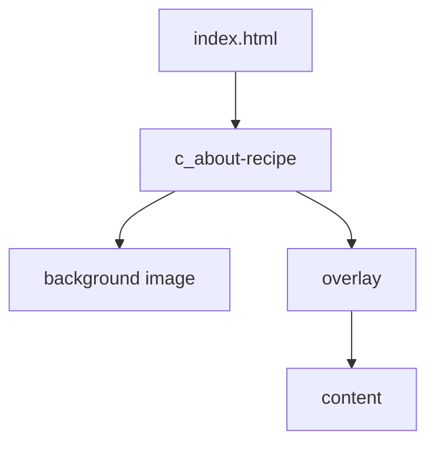
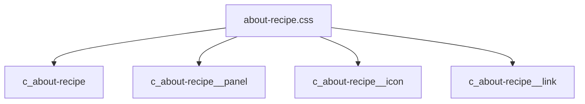
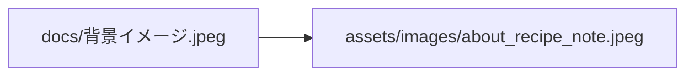

# 設計 無責任レシピとは

## 構成

既存の仮セクションを差し替える。



## HTML

`index.html` の「無責任レシピとは」を差し替える。

```html
<section class="c_about-recipe">
  <div class="c_about-recipe__panel">
    
    <h2 class="c_about-recipe__title">無責任レシピとは</h2>
    <p class="c_about-recipe__lead">完璧じゃなくていい。</p>
    <div class="c_about-recipe__body">
      <p>本文</p>
    </div>
    <a class="c_about-recipe__link" href="https://chapdaddy.buyshop.jp/" target="_blank" rel="noopener noreferrer">
      <span>Chapdaddyの気分が上がる道具を見る</span>
      <span class="material-symbols-outlined" aria-hidden="true">arrow_forward</span>
    </a>
  </div>
</section>
```

## CSS

CSSは `css/about-recipe.css` に置く。



| クラス | 方針 |
|---|---|
| `c_about-recipe` | 背景画像を持つ |
| `c_about-recipe__panel` | 暗い透過ボックス |
| `c_about-recipe__icon` | 白いアイコン |
| `c_about-recipe__title` | 白い見出し |
| `c_about-recipe__body` | 白い本文 |
| `c_about-recipe__link` | 白いテキストリンク |

## 画像

背景画像を公開素材へ複製する。



| 項目 | 内容 |
|---|---|
| 元画像 | `docs/.../背景イメージ.jpeg` |
| 配置先 | `assets/images/about_recipe_note.jpeg` |
| 用途 | CSS背景 |

## CSS入口

`style_v2.css` にimportを追加する。

```css
@import url("./about-recipe.css") layer(components);
```

## 注意

| 項目 | 内容 |
|---|---|
| 可読性 | 暗い透過ボックスで確保する |
| スマホ幅 | 文字が詰まらないようにする |
| アイコン | 白く見える処理をする |
| 既存変更 | 勝手に戻さない |
