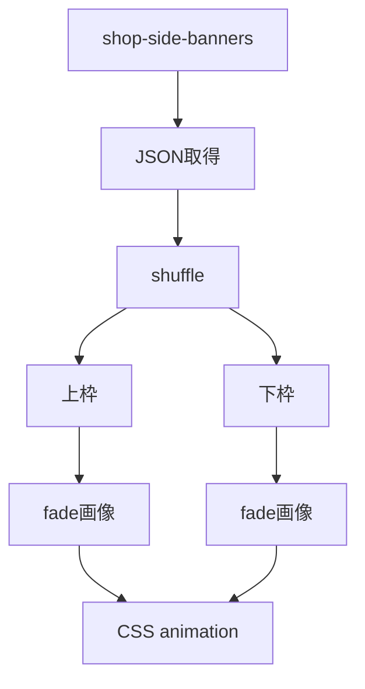
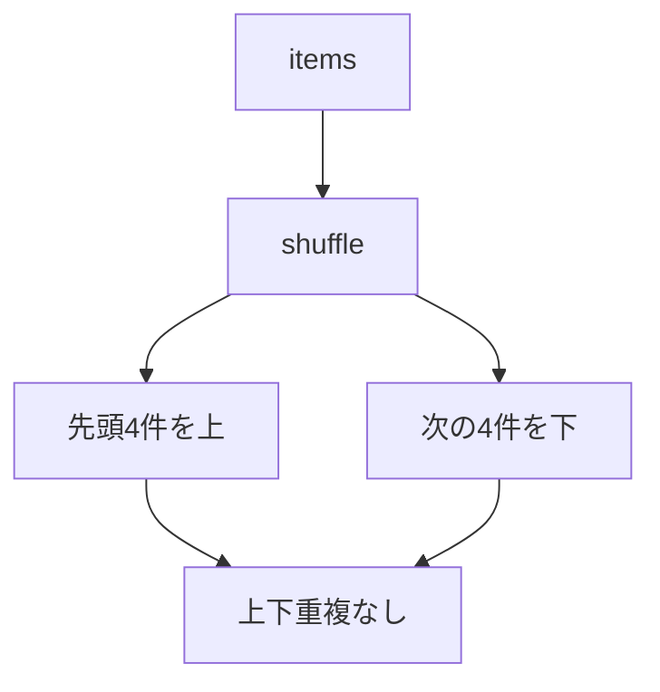
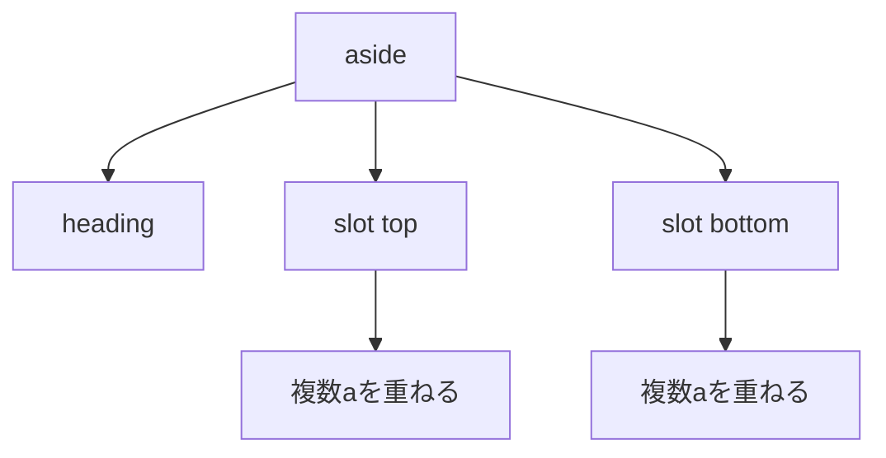
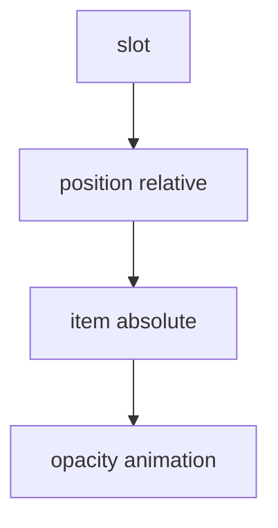
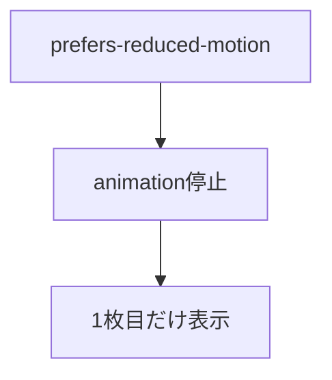

# 設計 PC左右バナーフェード

## 構成

## 基本方針

- Swiperは使わない。
- JSでHTMLを生成する。
- CSS animationでフェードする。

## 選択アルゴリズム

候補が少ない場合。

| 件数 | 対応 |
|---|---|
| 0件 | 列を非表示 |
| 1件 | 1枠だけ表示 |
| 2件以上 | 上下に分ける |
| 4件未満の枠 | 不足分を補充する |

補充時は同じ枠内の重複を避ける。

補充時は同じタイミングの上下重複を避ける。

## HTML生成

| class | 役割 |
|---|---|
| `.c_side-banners__slot` | 1つの表示枠 |
| `.c_side-banners__fade` | 重ねる親 |
| `.c_side-banners__item` | 商品リンク |
| `.c_side-banners__image` | 商品画像 |

## CSS

フェード仕様。

| 項目 | 値 |
|---|---|
| 4件周期 | 24秒 |
| 切替 | 6秒ごと |
| フェード | 3秒 |

## reduced motion

## 注意

- 上下に同じ商品を出さない。
- 全枠を4件に揃えて切替タイミングを合わせる。
- 左右列は別データなので左右間の重複は見ない。
- 商品リンクは画像ごとに維持する。
- 既存のPC専用表示条件を維持する。
