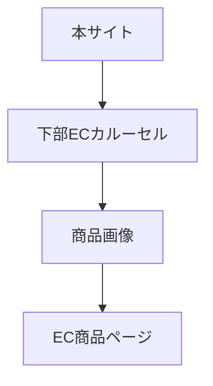
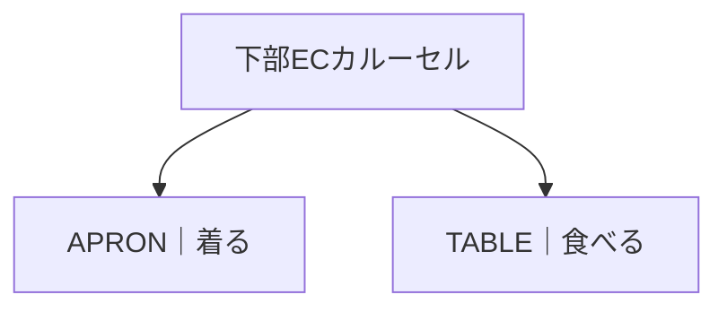
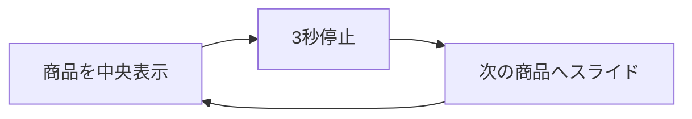

# 要件定義 下部ECカルーセル

## 目的

本サイト下部からEC商品ページへ送客する。

## 対象

| 対象 | 内容 |
|---|---|
| 表示場所 | ページ下部 |
| 対象ページ | `<shop-banner>` があるページ |
| 対象外 | PC左右ランダムバナー |

## 表示内容

| 項目 | 内容 |
|---|---|
| 段数 | 2段 |
| 上段 | APRON｜着る |
| 下段 | TABLE｜食べる |
| 見出し | 表示する |
| アイコン | `assets/images/icon-chapdaddy.avif` |
| 商品表示 | 画像のみ |
| 価格 | 表示しない |

## データ

| 種別 | JSON |
|---|---|
| APRON｜着る | `data/shop-apron.json` |
| TABLE｜食べる | `data/shop-table.json` |

JSONは以下を使う。

| キー | 用途 |
|---|---|
| `name` | 画像の `alt` |
| `image_url` | 商品画像 |
| `product_url` | 商品リンク |

## 挙動

| 項目 | 内容 |
|---|---|
| 自動スライド | あり |
| 停止時間 | 中央で3秒 |
| 操作ボタン | なし |
| 左右チラ見せ | あり |
| リンク | 別タブで開く |
| 動きを減らす設定 | スライド停止 |

## 画像仕様

| 項目 | 内容 |
|---|---|
| 比率 | 正方形 |
| 表示方法 | `contain` |
| 幅 | コンテナ幅に対する相対値 |
| 想定幅 | 375pxから480px程度を基準に調整 |

## 未定義

PC左右ランダムバナーは後で仕様を決める。
