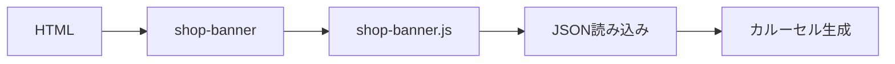
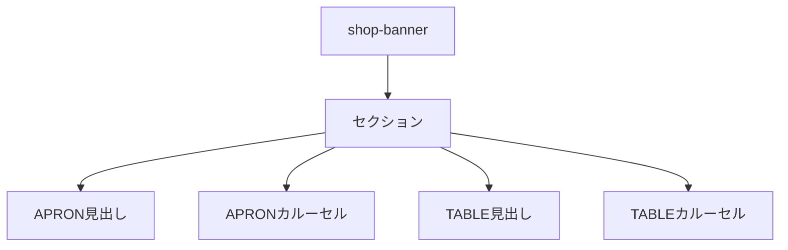
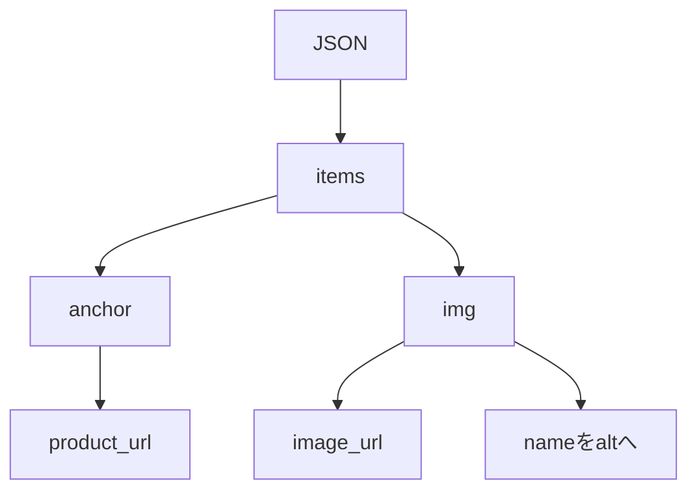
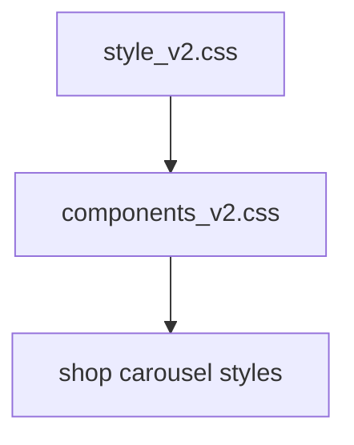
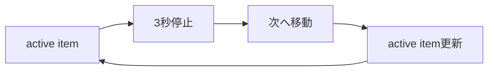

# 設計 下部ECカルーセル

## 構成

既存の `<shop-banner>` を下部ECカルーセルへ置き換える。

## コンポーネント

## データフロー

## HTML生成

| 要素 | 内容 |
|---|---|
| ラッパー | 下部ECエリア |
| 見出し | アイコン + `APRON｜着る` |
| 見出し | アイコン + `TABLE｜食べる` |
| 商品 | `<a>` 内に `` |
| 画像alt | JSONの `name` |
| リンク | `target="_blank"` |
| 安全属性 | `rel="noopener noreferrer"` |

## CSS配置

CSSは既存のレイヤー構成に合わせる。

| 種類 | 配置 |
|---|---|
| UI部品 | `css/components_v2.css` |
| 余白値 | 既存トークンを優先 |
| 例外 | 必要時のみ `css/utilities_v2.css` |

## CSS方針

| 項目 | 方針 |
|---|---|
| 商品幅 | `%` 指定 |
| 比率 | `aspect-ratio: 1 / 1` |
| 画像 | `object-fit: contain` |
| はみ出し | 横方向に見せる |
| Nesting | 2階層まで |
| `!important` | 使わない |

## スライド方式

中央で3秒停止してから次の商品へ進む。

| 項目 | 内容 |
|---|---|
| 停止 | 中央で3秒 |
| 方向 | 横方向 |
| 操作 | 自動のみ |
| ループ | 最後の次は先頭 |
| reduced motion | 停止 |

## エラー時

| 状態 | 対応 |
|---|---|
| JSON取得失敗 | 該当段を非表示 |
| 商品0件 | 該当段を非表示 |
| 画像失敗 | 該当画像を非表示 |

## 実装対象外

PC左右ランダムバナーは実装しない。
